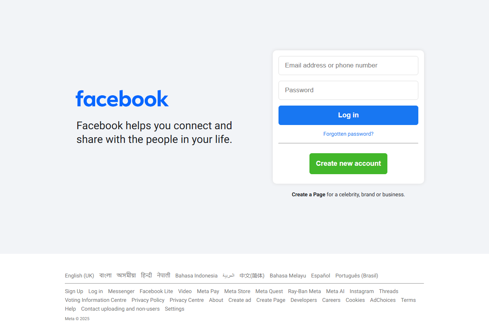
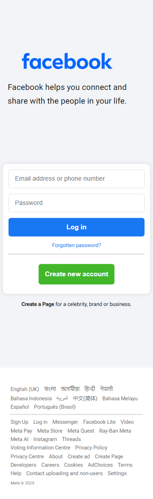

# CSS FB Login Page Clone

## Overview

### The challenge

Users should be able to:

- View the optimal layout depending on their device's screen size
- See hover and focus states for interactive elements

### Screenshot

### Links

- Live Site URL: [FB Clone](#)

## My process

### Built with

- Semantic HTML5 markup
- CSS custom properties
- Flexbox

## Author

- Frontend Mentor - [@sohanurshadhin](https://www.frontendmentor.io/profile/sohanurshadhin)
- Instagram - [@SohanurShadhin](https://www.instagram.com/sohanurshadhin/)
- LinkedIn - [@sohanurshadhin](https://www.linkedin.com/in/sohanurshadhin/)
- X - [@SohanurShadhinn](https://x.com/SohanurShadhinn)
